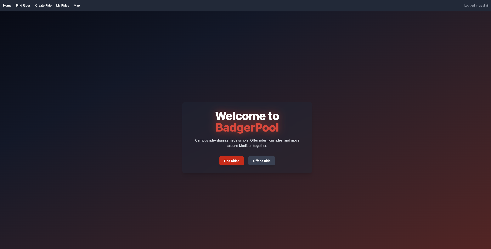
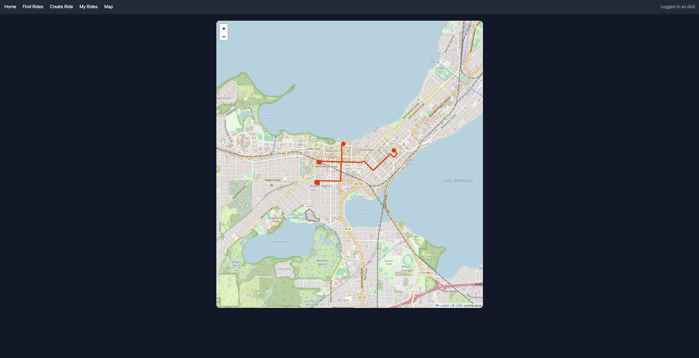
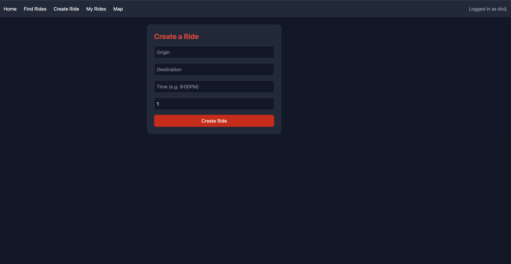

# BadgerPool  
**Campus Ride-Pooling for UW–Madison**

  
  
  
  
  

---

### 📖 About the Project
**BadgerPool** is a **ride-pooling web app built for the UW–Madison campus community**.  
Think of it as a campus-scale Uber — connecting students who need rides with students who have cars, reducing costs and making transportation more sustainable.  

 **Key Features**
-  **User Authentication** — quick login with persistent sessions.  
-  **Create Rides** — drivers can offer rides with origin, destination, time, and available seats.  
-  **Find Rides** — riders can search & filter rides by destination, time, or availability.  
-  **Interactive Map (Google Maps + Leaflet)** — visualize all rides on a map with origins/destinations & valid street routes.  
-  **Request Stops** — join rides mid-route if your location is on the way.  
-  **Live Vehicle Tracking** — see the car moving on the map with ETA updates (WebSockets).  
-  **Seat Management** — joining a ride asks how many riders; seats update in real time.  
-  **Smart Filtering** — full or expired rides disappear from listings and maps automatically.  
-   **Responsive UI** — optimized for desktop and mobile.

---

### 🖼 Screenshots  

  
  
  

---

### ⚙️ Tech Stack

**Frontend**  
- React 18 (Vite + TailwindCSS)  
- React Router for navigation  
- React-Leaflet + Google Maps Directions API for map rendering & routing  

**Backend**  
- Node.js + Express.js REST API  
- SQLite3 database  
- WebSockets (Socket.IO) for real-time ride updates & live tracking  

**APIs & Services**  
- Google Maps Geocoding API (turn addresses into lat/lng)  
- Google Directions API (real street routes, not straight lines)  
- TailwindCSS & custom UI for styling  

---

